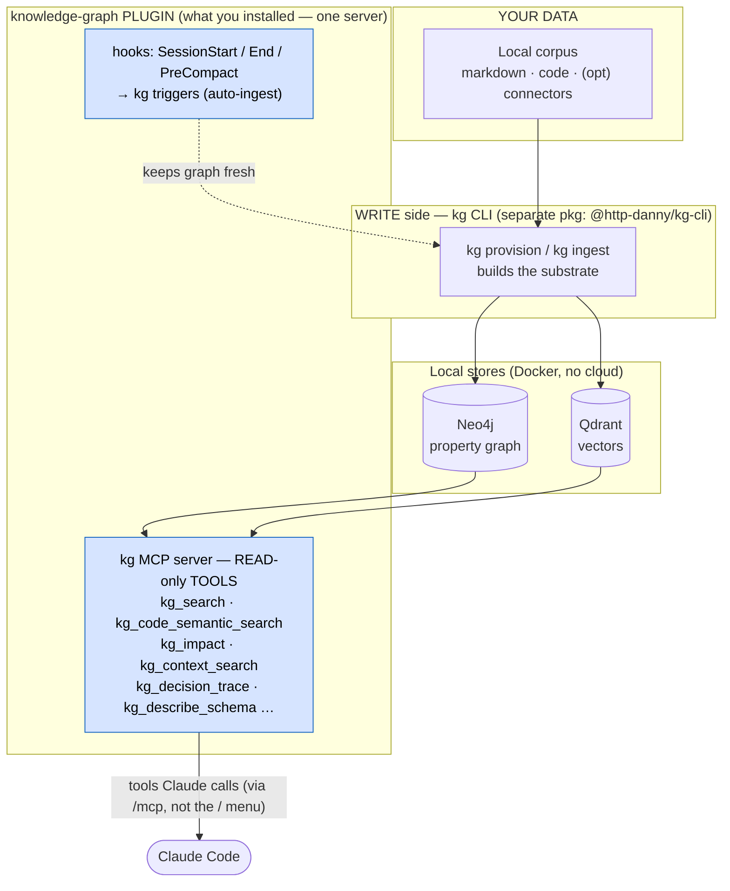

# knowledge-graph plugin

Read-only **hybrid GraphRAG + code-intelligence** MCP tools for your coding agent —
Claude Code, Gemini CLI, and Codex CLI.

This repository is the **distribution surface only**. It is generated on every release
from [http-danny/knowledge-graph](https://github.com/http-danny/knowledge-graph) — the
source of truth and the home of the `kg` operator CLI.

> Do not open PRs here; this repo is regenerated and force-synced. File issues and
> changes against [http-danny/knowledge-graph](https://github.com/http-danny/knowledge-graph).

## What you get

The read-only `kg` MCP server exposes tools (`kg_search`, `kg_code_semantic_search`,
`kg_impact`, and more) over a local Neo4j + Qdrant substrate built from your corpus.
Read-only by design; nothing here egresses.

## How it fits together

This plugin ships exactly one thing: the read-only **`kg` MCP server**. There are
**no slash commands and no skills**, so the `/knowledge-graph:` slash menu is empty —
that's expected. The value is the `kg` **tools**, which Claude calls for you (look
under `/mcp`), and they return results only once the **write side**
(`@http-danny/kg-cli`) has ingested your corpus into a local Neo4j + Qdrant: no
ingest, no results.



The left half (CLI → Neo4j/Qdrant) is the prerequisite — no ingest, no results.

**Power users:** want hand-written Cypher? Run the CLI with `--profile full` for the
`kg_run_cypher` tool, or add the official `mcp-neo4j-cypher` server yourself. Want the
Neo4j helper skills? Install [`neo4j-contrib/neo4j-skills`](https://github.com/neo4j-contrib/neo4j-skills)
separately — they apply to any Neo4j graph, including this one.

## Prerequisites

These tools **read** a substrate that the `kg` CLI **builds**. Before they return results:

1. Build and ingest a corpus with the `kg` CLI — see the
   [main repo quickstart](https://github.com/http-danny/knowledge-graph#quickstart).
2. Default connection env (overridable): `KG_NEO4J_URI=bolt://127.0.0.1:7687`,
   `KG_QDRANT_URL=http://127.0.0.1:6333`.

## Install

### Claude Code

```text
/plugin marketplace add http-danny/knowledge-graph-plugin
/plugin install knowledge-graph
```

### Gemini CLI

```bash
git clone https://github.com/http-danny/knowledge-graph-plugin.git
gemini extensions install ./knowledge-graph-plugin/agents/gemini
```

### Codex CLI

```bash
git clone https://github.com/http-danny/knowledge-graph-plugin.git
codex plugin marketplace add ./knowledge-graph-plugin
codex plugin install knowledge-graph@knowledge-graph-marketplace
```

### Other agents (Cursor, VS Code, Windsurf, Cline, Zed, opencode, continue)

You don't need this repo. Generate the per-agent config with the `kg` CLI:

```bash
kg mcp-config --agent cursor --write
```

## Versioning

`main` tracks the latest release by commit SHA, so installs auto-update. Tags `vX.Y.Z`
pin a release — reference a tag from your marketplace entry to stay fixed.

## License

MIT — see [LICENSE](LICENSE) and [NOTICE.md](NOTICE.md).
